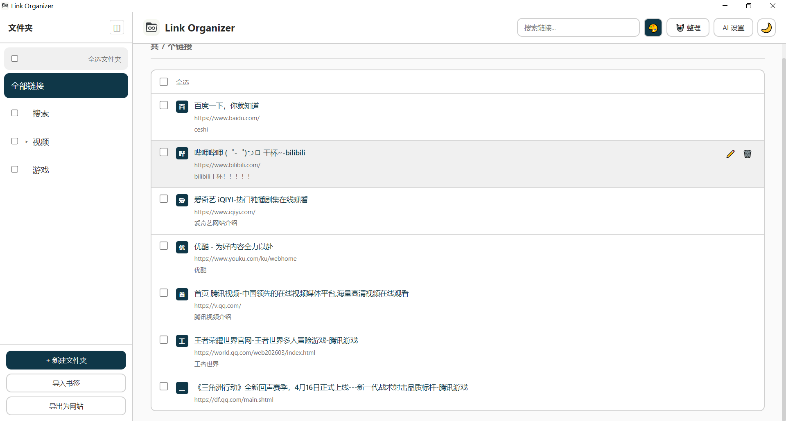
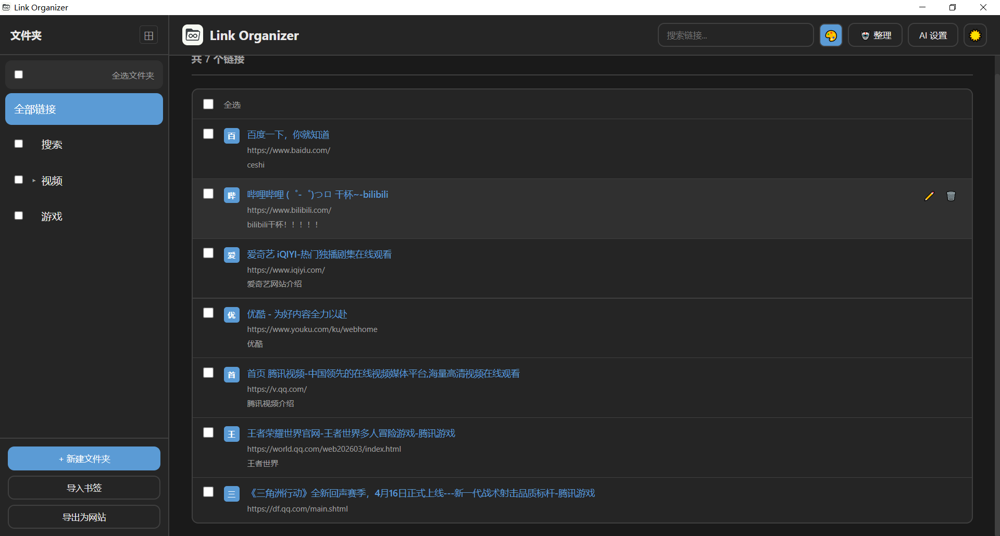
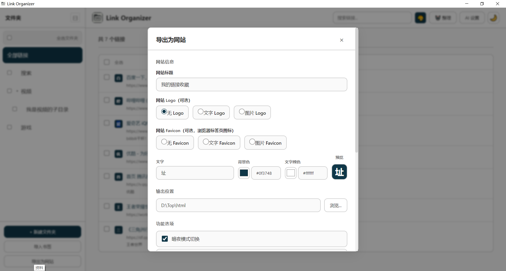
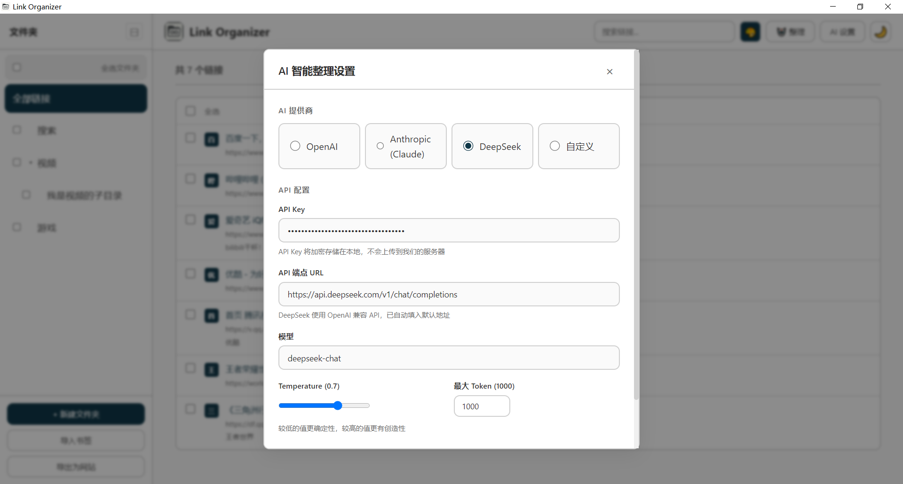
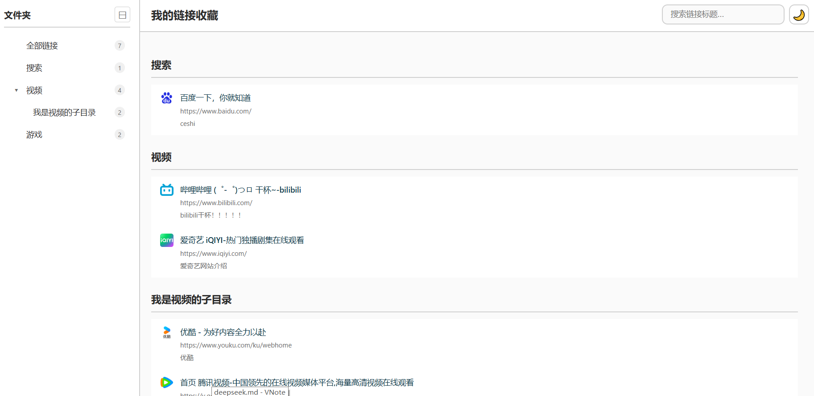
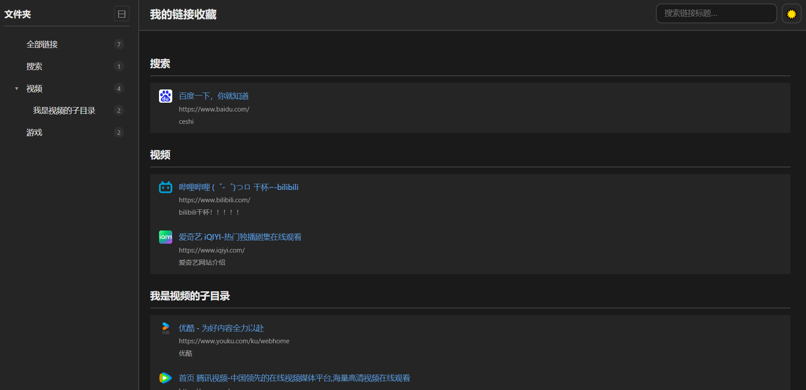
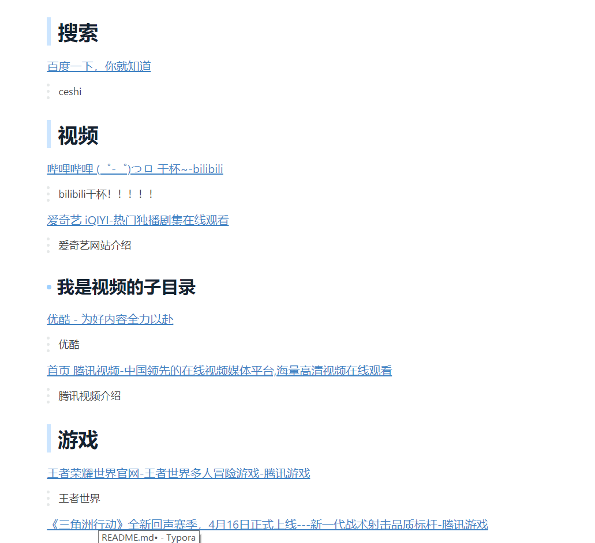

<h1 align="center">Link Organizer</h1>

<p align="center">
  
  
  
  
</p>
基于 Electron 的桌面端链接管理工具，支持导入浏览器书签、AI 智能分类整理、导出为静态网站。

## 功能

- **链接管理**：添加、编辑、删除排序链接，支持多级文件夹分类
- **书签导入**：支持导入 Chrome / Edge / Firefox 浏览器书签、HTML 书签文件、Markdown 格式文件
- **AI 智能整理**：接入 DeepSeek / OpenAI 等 AI 大模型，自动分析链接内容并智能分类归组，支持分批处理大量链接
- **撤销还原**：AI 整理前自动备份，不满意可一键还原
- **导出静态网站**：将所有链接导出为独立的 HTML 静态网站，支持暗夜模式、搜索、侧边栏导航、回到顶部
- **自定义主题**：支持亮色/暗色模式切换，可独立设置各模式的主题色
- **自定义 Logo**：支持设置导出网站的 Favicon logo
- **搜索过滤**：快速搜索链接标题

> 未测试：导入Firefox标签，html导入，OpenAI整理链接

## 技术栈

| 层级 | 技术 |
|------|------|
| 框架 | Electron 28 |
| 前端 | React 18 + TypeScript |
| 构建 | Vite 5 + vite-plugin-electron |
| 状态管理 | React useState + zustand |
| 数据存储 | electron-store |
| UI | 纯 CSS |
| AI 集成 | node-fetch |
| 打包 | electron-builder |

## 本地部署

### 环境要求

- Node.js >= 18
- npm >= 9

### 安装

```bash
git clone https://github.com/mao-design/Link-Organizer.git
cd link-organizer
npm install
```

### 开发模式

```bash
npm run dev
```

启动 Electron 窗口 + Vite HMR 热更新。

### 构建

```bash
# 构建前端和主进程
npm run build

# 打包为 Windows exe
npx electron-builder build --win
```

产物在 `build-out/` 目录

`pack.bat`脚本会将项目打包成 Windows exe，打包好的程序在 `build-out`文件夹下

`dev.bat`脚本将会在本地预览项目

## 图片显示

软件界面









---

导出的静态网页





## MD导入标签

导入书签：MD导入语法



MD源码

```md
## 搜索

[百度一下，你就知道](https://www.baidu.com/)

> ceshi

## 视频

[哔哩哔哩 (゜-゜)つロ 干杯~-bilibili](https://www.bilibili.com/)

> bilibili干杯！！！！！

[爱奇艺 iQIYI-热门独播剧集在线观看](https://www.iqiyi.com/)

> 爱奇艺网站介绍

### 我是视频的子目录

[优酷 - 为好内容全力以赴](https://www.youku.com/ku/webhome)

> 优酷

[首页 腾讯视频-中国领先的在线视频媒体平台,海量高清视频在线观看](https://v.qq.com/)

> 腾讯视频介绍

## 游戏

[王者荣耀世界官网-王者世界多人冒险游戏-腾讯游戏](https://world.qq.com/web202603/index.html)

> 王者世界

[《三角洲行动》全新回声赛季，4月16日正式上线---新一代战术射击品质标杆-腾讯游戏](https://df.qq.com/main.shtml)
```


## 项目结构

```
Top/
├── .github/workflows/    # GitHub Actions CI/CD
├── src/
│   ├── main/             # Electron 主进程
│   │   ├── ipc/          # IPC 通信处理
│   │   │   ├── ai.ts     # AI 整理接口
│   │   │   ├── app.ts    # 应用状态接口
│   │   │   ├── bookmarks.ts  # 书签导入接口
│   │   │   ├── export.ts # 导出接口
│   │   │   ├── folders.ts # 文件夹 CRUD
│   │   │   └── links.ts  # 链接 CRUD
│   │   ├── services/     # 业务逻辑
│   │   │   ├── aiOrganizer.ts    # AI 分批整理引擎
│   │   │   ├── bookmarkParser.ts # 浏览器书签解析
│   │   │   ├── mdParser.ts       # Markdown 解析
│   │   │   ├── siteGenerator.ts  # 静态网站生成
│   │   │   └── storageService.ts # 数据持久化
│   │   ├── types/        # 类型定义
│   │   ├── index.ts      # 主进程入口
│   │   └── window.ts     # 窗口管理
│   ├── preload/          # 预加载脚本
│   └── renderer/         # 渲染进程（React UI）
│       ├── components/   # React 组件
│       │   ├── AI/       # AI 设置弹窗
│       │   ├── Export/   # 导出设置弹窗
│       │   ├── Import/   # 导入弹窗
│       │   ├── Layout/   # Header / Sidebar / MainContent
│       │   └── Link/     # 链接编辑弹窗
│       ├── ico/          # 图标资源
│       ├── styles/       # 全局样式
│       ├── types/        # 渲染进程类型
│       ├── App.tsx       # 根组件
│       └── main.tsx      # React 入口
├── dist/                 # 构建产物
├── package.json
├── vite.config.ts
└── tsconfig.json
```

## 注意事项

1. **AI 整理功能**需要配置 API Key（支持 DeepSeek / OpenAI / Anthropic），在 App 的「AI 设置」中配置
2. **首次打包**需要下载 Electron 二进制文件，国内建议用镜像：设置环境变量 `ELECTRON_MIRROR=https://npmmirror.com/mirrors/electron/`
3. **Windows 本地打包**如遇 `app.asar` 被占用，先关闭所有 Electron 进程再重试
4. 数据存储在本地 `electron-store` 中，卸载不会自动清除

## License

MIT

## Star History

[](https://www.star-history.com/?repos=mao-design%2Flink-organizer%2Cmao-design%2FLink-Organizer&type=date&legend=top-left)